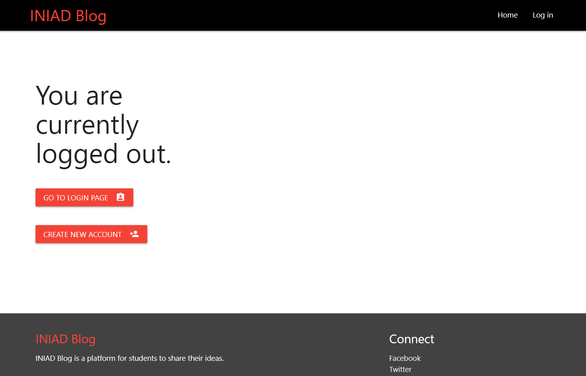
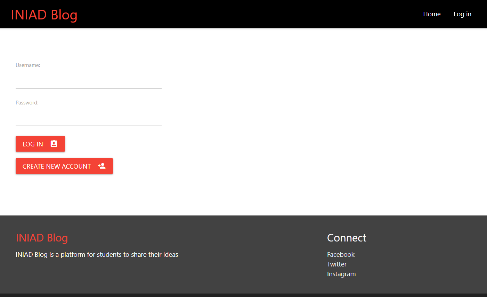
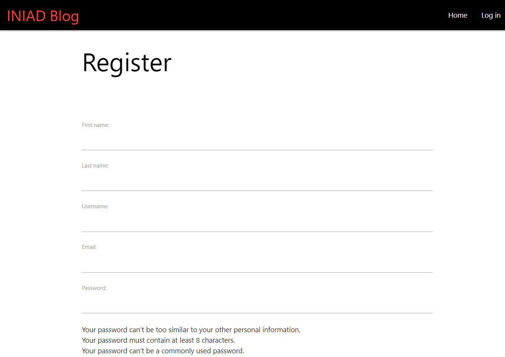
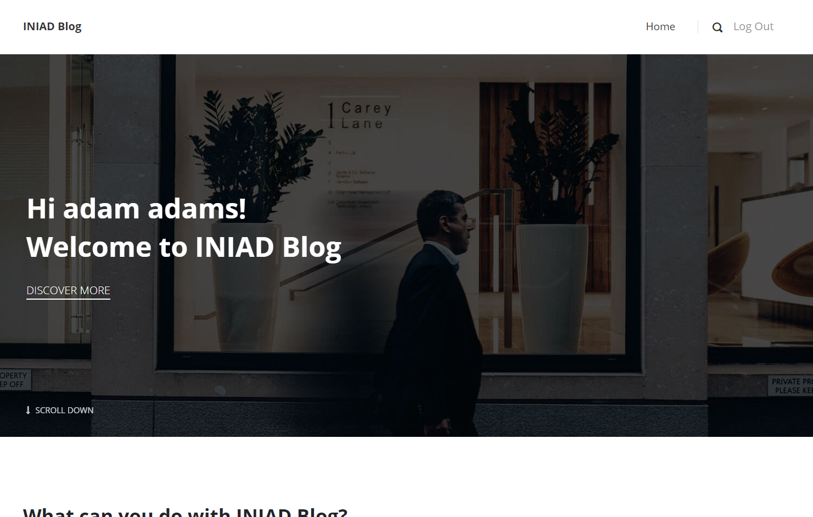
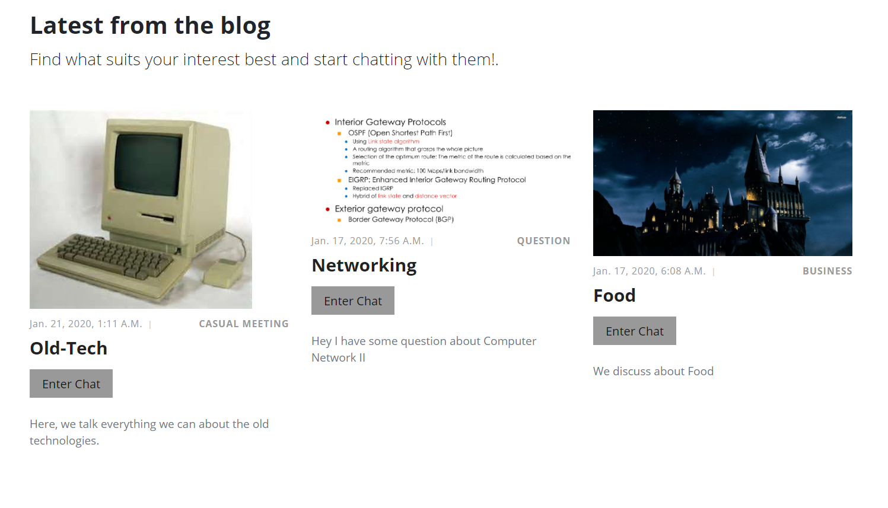
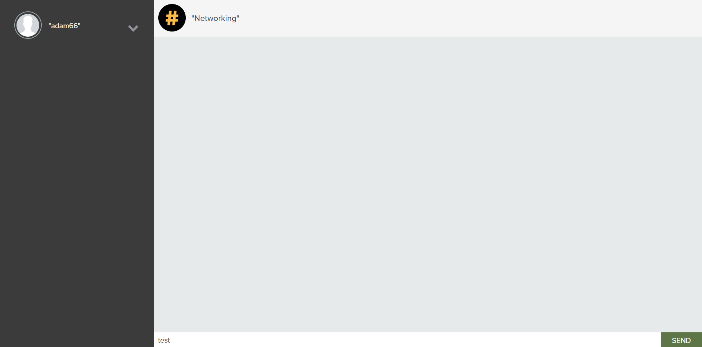

# INIAD Blog
INIAD is the name of the campus I'm studying at. [More about INIAD](iniad.org)
### Purpose of INIAD Blog
INIAD Blog is a platform where all the students in the campus can exchange information.

## How to Run it locally
Make sure your local drive has [Django](https://docs.djangoproject.com/en/3.1/topics/install/) installed.

Once you have everything setup, do the following:

#### [For Windows]
- Open command prompt.
- Go to the directory where this file is located.
- Enter this on command prompt.
```
.\inidate2019\Scripts\activate
```
- then this
```
 python .\manage.py runserver
```
or 
```
 py .\manage.py runserver
```
- The website should now be accessible at http://localhost:8000/home_feed/

## Screenshots
- Front page   
    - 
- Login page
    - 
- Register page
    - 
- Home page (after logged in)
    - 
- Home page (chat rooms display)
    - 
- Chat room
    - 
